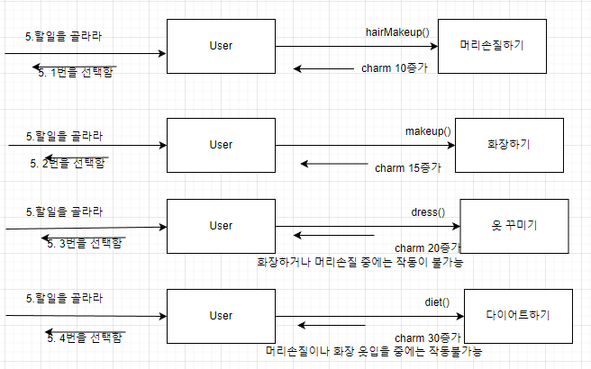
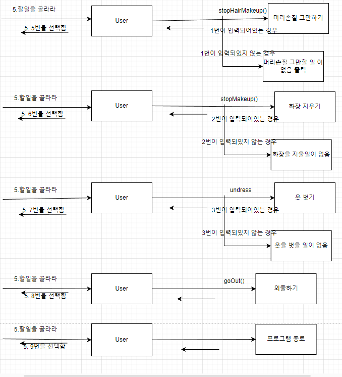

# 1.프로그램 제목 
캐릭터 꾸미기
# 2.프로그램 요약 
기본캐릭터의 머리손질을 1번 추가할때 마다 매력도 10증가 화장할 떄 마다 15증가 옷 꾸밀때마다 매력도 20증가 다이어트 1번 할때마다 매력도 30증가 하는 게임으로 캐릭터가 다이어트 중에는 옷이나 메이크업 머리손질에 신경쓸수 없고 화장이나 머리를 할 때는 옷을 입어볼수 없는 게임이다.마지막 외출로 결과물을 얻을 수 있다.기본캐릭터는 부모클래스가 되어 남녀 캐릭터 타입의 자식클래스를 상속을 해 줄 수 있다.남녀타입을 랜덤으로 결정해줄 수 있다. 
# 3.프로그램 요구사항
게임을 시작하기 전 미니게임으로 독심술게임을 만들어 수당을 가져가는 프로그램을 만들어 게임을 플레이할 수있냐 없냐를 결정할 수 있게해줄 수 있어야 한다. 머리손질 하다가 옷 입힐수 없고 화장하다 옷 입힐 수 없고  옷 꾸미다가 다이어트할수 없고 다이어트하다가 다른 것을 할 수 없다. 단 머리 손질하면서 화장할수는 있다.
# 4.커뮤니케이션다이어그램
</img>
</img>
</img>
</img>
</img>

# 5.클래스다이어그램 </img>